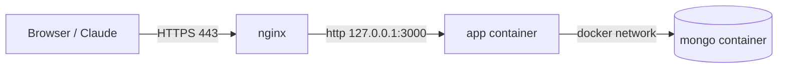

# Deploying Silva's Tab (Debian + nginx)

Target: `https://tab.example.com` → nginx (TLS) → `127.0.0.1:3000` (app container) → `mongo` (internal Docker network only).

Replace `tab.example.com`, `user@server` and paths with your own values.



## 0. Prerequisites

- A DNS `A`/`AAAA` record for `tab.example.com` pointing to the server.
- Ports 80 and 443 open. If you use `ufw`: `sudo ufw allow OpenSSH && sudo ufw allow 'Nginx Full'`.
- MongoDB 5+ needs AVX: `grep -m1 -o avx /proc/cpuinfo` must print `avx`. Otherwise use `image: mongo:4.4` in `docker-compose.yml`.

## 1. Install Docker (official repository)

Debian's own packages ship an outdated Compose (bookworm) or lag behind; the official repo gives the current `docker compose` plugin.

```bash
sudo apt-get update
sudo apt-get install -y ca-certificates curl
sudo install -m 0755 -d /etc/apt/keyrings
sudo curl -fsSL https://download.docker.com/linux/debian/gpg -o /etc/apt/keyrings/docker.asc
sudo chmod a+r /etc/apt/keyrings/docker.asc
echo "deb [arch=$(dpkg --print-architecture) signed-by=/etc/apt/keyrings/docker.asc] https://download.docker.com/linux/debian $(. /etc/os-release && echo "$VERSION_CODENAME") stable" \
  | sudo tee /etc/apt/sources.list.d/docker.list > /dev/null
sudo apt-get update
sudo apt-get install -y docker-ce docker-ce-cli containerd.io docker-buildx-plugin docker-compose-plugin
```

Enable log rotation (Docker's default `json-file` driver never rotates):

```bash
echo '{ "log-driver": "local" }' | sudo tee /etc/docker/daemon.json
sudo systemctl restart docker
```

## 2. Upload the code

From PowerShell on Windows (`tar` and `scp` are built in). `.env` is excluded on purpose: the server gets its own secrets.

```powershell
cd C:\Users\selya\Documents\Programmation\SilvaTab
tar -czf $env:TEMP\silvatab.tgz --exclude=node_modules --exclude=dist --exclude=.idea --exclude=.env .
scp $env:TEMP\silvatab.tgz user@server:/tmp/
```

On the server:

```bash
sudo mkdir -p /opt/silvatab
sudo tar -xzf /tmp/silvatab.tgz --no-same-owner -C /opt/silvatab
```

> Alternative: push the project to a private Git repo and `git clone` / `git pull` on the server. Cleaner for updates and history, but requires creating the repo and a deploy key.

## 3. Configure secrets

```bash
cd /opt/silvatab
sudo cp .env.example .env
sudo sed -i "s/^MCP_TOKEN=.*/MCP_TOKEN=$(openssl rand -hex 32)/" .env
sudo nano .env        # set SILVA_PASSWORD, keep BIND_ADDRESS=127.0.0.1
sudo chmod 600 .env
```

`BIND_ADDRESS=127.0.0.1` matters: Docker writes its own iptables rules and **bypasses ufw**, so a port published on `0.0.0.0` would be reachable from the internet in plain HTTP, skipping nginx.

## 4. Start

```bash
cd /opt/silvatab
sudo docker compose up -d --build
sudo docker compose ps                 # both services "healthy"
curl -s http://127.0.0.1:3000/healthz  # {"ok":true}
```

Containers restart automatically on reboot (`restart: unless-stopped` + Docker enabled by systemd).

## 5. nginx

`/etc/nginx/sites-available/silvatab`:

```nginx
server {
    listen 80;
    listen [::]:80;
    server_name tab.example.com;

    # The app accepts bodies up to 5 MB (nginx default is 1 MB)
    client_max_body_size 5m;

    # Inherited by every location below (none of them redefines proxy_set_header)
    proxy_set_header Host $host;
    proxy_set_header X-Forwarded-Proto $scheme;
    # Overwrite instead of append: the app trusts this header, so a client-supplied
    # value would let anyone bypass the login rate limit.
    proxy_set_header X-Forwarded-For $remote_addr;

    location / {
        proxy_pass http://127.0.0.1:3000;
    }

    location /mcp {
        # The claude.ai connector sends the token in the query string: keep it out of the logs
        access_log off;
        proxy_read_timeout 300s;
        proxy_pass http://127.0.0.1:3000;
    }
}
```

```bash
sudo ln -s /etc/nginx/sites-available/silvatab /etc/nginx/sites-enabled/
sudo nginx -t && sudo systemctl reload nginx
```

`X-Forwarded-Proto` is what makes the session cookie `Secure` once HTTPS is on.

## 6. HTTPS (Let's Encrypt)

```bash
sudo apt-get install -y certbot python3-certbot-nginx
sudo certbot --nginx -d tab.example.com --redirect
```

Certbot adds the 443 block and the HTTP→HTTPS redirect to the file above, and installs a renewal timer (`systemctl list-timers | grep certbot`).

## 7. Smoke tests

```bash
# UI
curl -sI https://tab.example.com | head -1                        # HTTP/2 200

# MCP without token -> 401
curl -s -o /dev/null -w '%{http_code}\n' -X POST https://tab.example.com/mcp

# MCP with token -> JSON with "serverInfo"
TOKEN=$(sudo grep ^MCP_TOKEN= /opt/silvatab/.env | cut -d= -f2)
curl -s https://tab.example.com/mcp \
  -H "Authorization: Bearer $TOKEN" \
  -H 'Content-Type: application/json' \
  -H 'Accept: application/json, text/event-stream' \
  -d '{"jsonrpc":"2.0","id":1,"method":"initialize","params":{"protocolVersion":"2025-06-18","capabilities":{},"clientInfo":{"name":"curl","version":"1"}}}'
```

Then plug Claude in as described in the README (`https://tab.example.com/mcp`).

## 8. Backups

`/etc/cron.daily/silvatab-backup` (no dot in the name, or `run-parts` skips it):

```sh
#!/bin/sh
set -eu
dir=/var/backups/silvatab
mkdir -p "$dir"
cd /opt/silvatab
docker compose exec -T mongo mongodump --archive --gzip --db silvas-tab > "$dir/.partial"
mv "$dir/.partial" "$dir/silvatab-$(date +%F).archive.gz"
find "$dir" -name 'silvatab-*.archive.gz' -mtime +14 -delete
```

```bash
sudo chmod +x /etc/cron.daily/silvatab-backup
sudo /etc/cron.daily/silvatab-backup && ls -lh /var/backups/silvatab
```

Copy these files off the server regularly (a backup on the same disk is not a backup).

Restore:

```bash
cd /opt/silvatab
sudo docker compose exec -T mongo mongorestore --archive --gzip --drop < /var/backups/silvatab/silvatab-YYYY-MM-DD.archive.gz
```

## 9. Updating

Windows: same `tar` + `scp` as step 2. Server:

```bash
cd /opt/silvatab
sudo /etc/cron.daily/silvatab-backup
# Remove old sources (so deleted files don't linger), keep .env
sudo find . -mindepth 1 -maxdepth 1 ! -name .env -exec rm -rf {} +
sudo tar -xzf /tmp/silvatab.tgz --no-same-owner -C .
sudo docker compose up -d --build
sudo docker image prune -f
```

The `mongo-data` volume is untouched. Never run `docker compose down -v`: `-v` deletes the database.

## Operations cheat sheet

| Action | Command (in `/opt/silvatab`) |
|--------|------------------------------|
| Status | `sudo docker compose ps` |
| Logs | `sudo docker compose logs -f app` |
| Restart | `sudo docker compose restart app` |
| Stop | `sudo docker compose down` |
| Rotate MCP token | edit `.env`, then `sudo docker compose up -d` (update Claude's connector) |
| Change UI password | edit `.env`, then `sudo docker compose up -d` (logs everyone out) |

## Known caveat

Fastify logs each request URL, so with the `?token=` connector the MCP token appears in `docker compose logs app`. It stays on the server, but prefer the `Authorization` header when the client supports it, and rotate the token if logs are shared.
