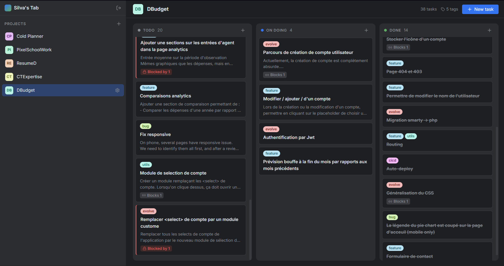
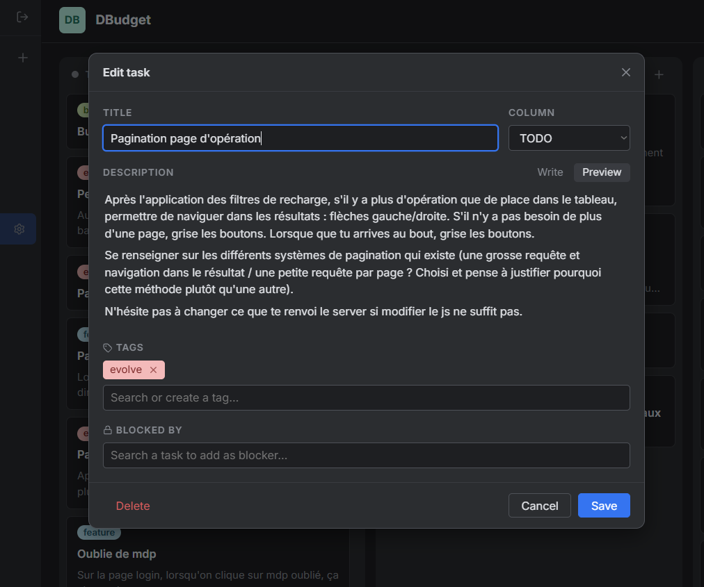

# Silva's Tab

Minimalist kanban board (TODO / On doing / Done) with a built-in **MCP server** so Claude can read and manage tasks.



- Projects list on the left, kanban board on the right, drag & drop between columns
- Tasks have a title, a Markdown description, **tags** and a list of **blocking tasks** (cycles are rejected, blocked cards get a red marker)
- Tags belong to a project: created on the fly from the task dialog, renamed / recolored / deleted from the "N tags" button of the board header
- No accounts: a single instance password for the UI, a separate token for MCP
- One container + MongoDB



## Stack

| Part | Choice |
|------|--------|
| Server | Node 22, Fastify, official MongoDB driver |
| Validation | Zod schemas in `shared/`, used by REST, MCP and the UI |
| MCP | `@modelcontextprotocol/sdk`, stateless Streamable HTTP at `/mcp` |
| Web | React, Vite, TanStack Query, `@hello-pangea/dnd`, `react-markdown`, lucide icons |
| Design | JetBrains New UI dark tokens (`web/src/theme.css`) |

```
server/     Fastify app (routes, services, MCP)
shared/     Zod schemas + helpers shared by server and web
web/        React SPA
```

## Deploy (Docker Compose)

```bash
cp .env.example .env        # set SILVA_PASSWORD and MCP_TOKEN (openssl rand -hex 32)
docker compose up -d --build
```

Open `http://localhost:3000` (set `BIND_ADDRESS=0.0.0.0` to reach it from the LAN). Data lives in the `mongo-data` volume.

Server deployment (Debian + nginx + HTTPS): see [DEPLOY.md](DEPLOY.md).

Put it behind a reverse proxy with HTTPS (Caddy, Traefik, nginx) as soon as it leaves your LAN: the session cookie becomes `Secure` automatically when the proxy sends `X-Forwarded-Proto: https`.

### Environment variables

| Variable | Required | Default | Description |
|----------|----------|---------|-------------|
| `SILVA_PASSWORD` | yes | | Web UI password. Changing it logs everybody out. |
| `MCP_TOKEN` | yes | | Token for MCP clients. |
| `MONGO_URL` | no | `mongodb://localhost:27017` | |
| `MONGO_DB` | no | `silvas-tab` | |
| `PORT` | no | `3000` | |
| `BIND_ADDRESS` | no | `127.0.0.1` | Host interface of the published port (compose only). |

## Local development

```bash
npm install
docker run -d -p 27017:27017 --name silva-mongo mongo:8
cp .env.example .env
npm run dev                 # API on :3000, UI on http://localhost:5173
```

`npm run build && npm start` runs the production build.

## MCP

Endpoint: `POST /mcp` (Streamable HTTP, stateless). Authentication, either:

- header `Authorization: Bearer <MCP_TOKEN>` (preferred)
- query string `?token=<MCP_TOKEN>` for clients that cannot send headers (the token can end up in proxy logs)

| Tool | Description |
|------|-------------|
| `list_projects` | All projects |
| `create_project` | Create a project |
| `list_tags` | Tags of a project |
| `list_tasks` | Tasks of a project grouped by column, optional `status` / `tag` filters and `includeDescription` |
| `get_task` | One task with its full description, tags and resolved blockers |
| `create_tasks` | Create 1..100 tasks; `blockedByIndexes` links to earlier items of the same call |
| `update_task` | Change title, description (specs), tags and/or blockers |
| `move_task` | Move to `todo` / `doing` / `done`, optional position |
| `delete_task` | Delete a task |

Tags are passed to MCP tools **by label** (case-insensitive); unknown labels are created with a random color.

### Plug Claude in

**Claude Code** (CLI):

```bash
claude mcp add --transport http silvas-tab https://tab.example.com/mcp \
  --header "Authorization: Bearer <MCP_TOKEN>"
```

Add `--scope user` to make it available in every project.

**Claude Desktop / Cowork — local config** (works even if the server is only reachable from your machine or LAN). Edit `claude_desktop_config.json` (Settings → Developer → Edit Config), Node must be installed:

```json
{
  "mcpServers": {
    "silvas-tab": {
      "command": "npx",
      "args": ["-y", "mcp-remote", "http://localhost:3000/mcp", "--header", "Authorization:${SILVA_AUTH}"],
      "env": { "SILVA_AUTH": "Bearer <MCP_TOKEN>" }
    }
  }
}
```

`mcp-remote` needs `--allow-http` for a non-localhost `http://` URL. Restart Claude Desktop afterwards.

**claude.ai / Claude Desktop / Cowork — custom connector** (server must be reachable from the internet over HTTPS, since Anthropic's servers make the calls). Customize → Connectors → `+` → Add custom connector, URL:

```
https://tab.example.com/mcp?token=<MCP_TOKEN>
```

Leave the OAuth fields empty.

## REST API

All routes except `/api/login` and `/api/session` require the session cookie.

```
POST   /api/login                 { password }
POST   /api/logout
GET    /api/session
GET    /api/projects
POST   /api/projects              { name }
PATCH  /api/projects/:id          { name }
DELETE /api/projects/:id          (also deletes its tasks and tags)
GET    /api/projects/:id/tags
POST   /api/projects/:id/tags     { label, hue? }
PATCH  /api/tags/:id              { label?, hue? }
DELETE /api/tags/:id              (also removes it from tasks)
GET    /api/projects/:id/tasks    ?status=todo|doing|done
POST   /api/projects/:id/tasks    { title, description?, status?, blockedBy?, tags? }
PATCH  /api/tasks/:id             { title?, description?, blockedBy?, tags? }
POST   /api/tasks/:id/move        { status, position? }
DELETE /api/tasks/:id
GET    /healthz
```

## Notes

- MongoDB 5+ requires a CPU with AVX. On older hardware or some virtual machines, use `mongo:4.4`.
- The board refreshes every 4 seconds, so changes made by Claude show up without reloading.
