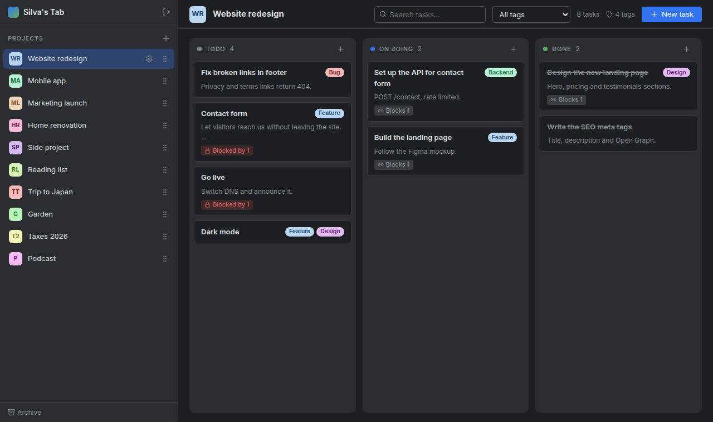
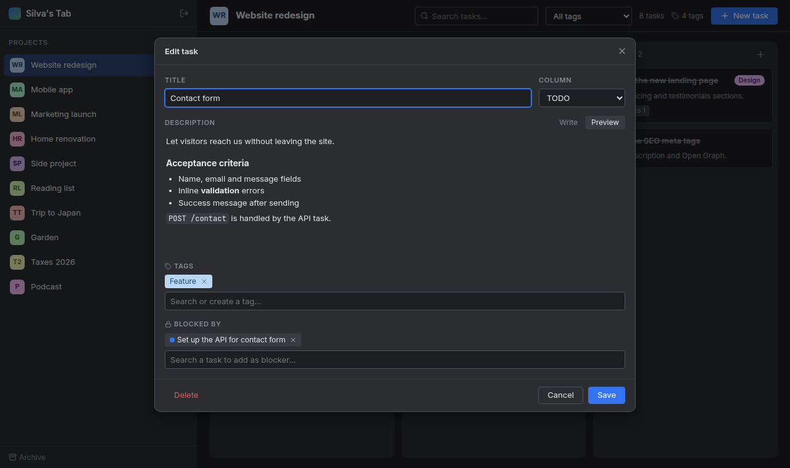
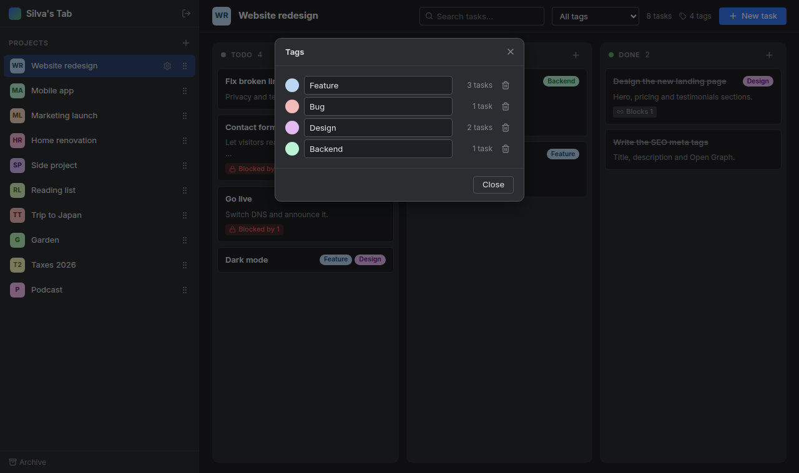
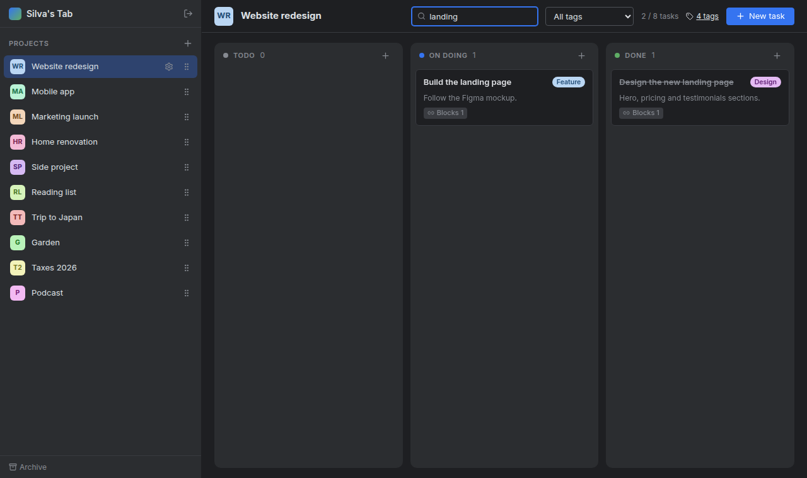
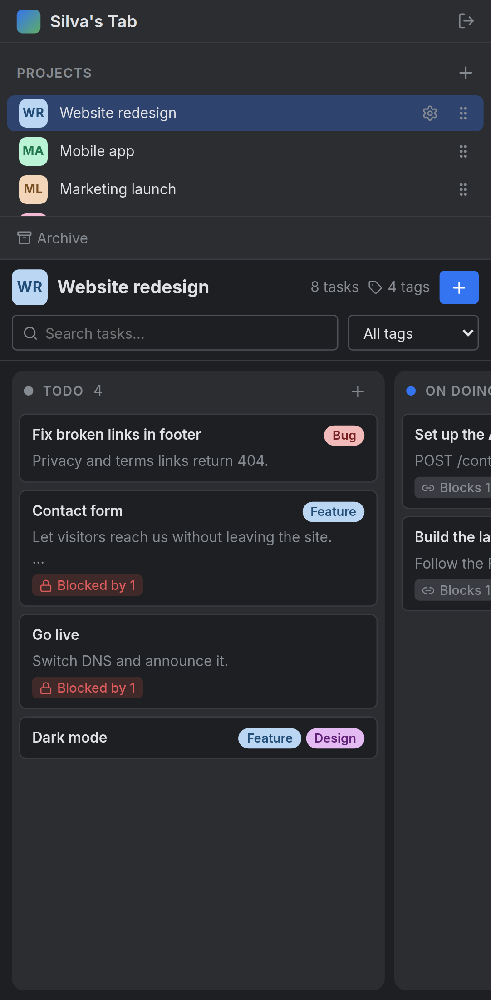

# Silva's Tab

A minimalist kanban board for personal projects, that **Claude can read and update for you**.



## What you can do

### Organize projects

- Keep all projects in the left column, each with its own color and initials.
- Reorder them by dragging the grip on the right of each project.
- Archive the projects you don't work on anymore: they leave the list and come back in one click from the **Archive** button.

### Track tasks

- Three columns: **TODO**, **On doing** and **Done**. Drag & drop a card to move it.
- Write the details of a task in Markdown (lists, headings, code…), with a live preview.
- Say which tasks must be finished first with **Blocked by**: the card shows a red *Blocked by* badge until they are done.



### Tag and find

- Add tags to tasks, created on the fly while typing.
- Rename, recolor or delete them from the **tags** button of the board.
- Search tasks by text and filter them by tag.





### Let Claude work with you

Connect Claude to the board and just ask:

- *"What's left to do on Website redesign?"*
- *"Split this feature into tasks, with their dependencies."*
- *"Take the next ticket in TODO and do it."*

Claude can list projects and tasks, filter them by column or tag, create tasks (with tags and blockers), edit them and move them between columns. The board refreshes by itself, so its changes show up live.

### On your phone too

The layout adapts to small screens: swipe between columns, scroll the project list, open any task.



## Installation

Silva's Tab runs with Docker (one app container + MongoDB). It is protected by a single password, no account needed.

```bash
cp .env.example .env        # set SILVA_PASSWORD and MCP_TOKEN (openssl rand -hex 32)
docker compose up -d --build
```

Open `http://localhost:3000`. Set `BIND_ADDRESS=0.0.0.0` in `.env` to reach it from your local network.

| Variable | Required | Default | Description |
|----------|----------|---------|-------------|
| `SILVA_PASSWORD` | yes | | Password of the web interface. Changing it logs everybody out. |
| `MCP_TOKEN` | yes | | Secret used by Claude to connect. |
| `MONGO_URL` | no | `mongodb://localhost:27017` | |
| `MONGO_DB` | no | `silvas-tab` | |
| `PORT` | no | `3000` | |
| `BIND_ADDRESS` | no | `127.0.0.1` | Network interface the app listens on (Docker Compose only). |

To put it online with HTTPS (Debian + nginx), follow [DEPLOY.md](DEPLOY.md).

> MongoDB 5+ needs a CPU with AVX. On older hardware or some virtual machines, use the `mongo:4.4` image.

### Connect Claude

The board exposes an MCP server at `/mcp`, authenticated with `MCP_TOKEN`.

**Claude Code**

```bash
claude mcp add --transport http silvas-tab https://tab.example.com/mcp \
  --header "Authorization: Bearer <MCP_TOKEN>"
```

Add `--scope user` to use it in every project.

**Claude Desktop / Cowork, local config** (works even when the board is only reachable from your machine or network). Edit `claude_desktop_config.json` (Settings → Developer → Edit Config), Node must be installed:

```json
{
  "mcpServers": {
    "silvas-tab": {
      "command": "npx",
      "args": ["-y", "mcp-remote", "http://localhost:3000/mcp", "--header", "Authorization:${SILVA_AUTH}"],
      "env": { "SILVA_AUTH": "Bearer <MCP_TOKEN>" }
    }
  }
}
```

Add `--allow-http` to the args for a non-localhost `http://` URL, then restart Claude Desktop.

**claude.ai / Claude Desktop / Cowork, custom connector** (the board must be reachable from the internet over HTTPS). Customize → Connectors → `+` → Add custom connector, with the URL below and empty OAuth fields:

```
https://tab.example.com/mcp?token=<MCP_TOKEN>
```

### Development

```bash
npm install
docker run -d -p 27017:27017 --name silva-mongo mongo:8
cp .env.example .env
npm run dev                 # API on :3000, UI on http://localhost:5173
```

`npm run build && npm start` runs the production build.
